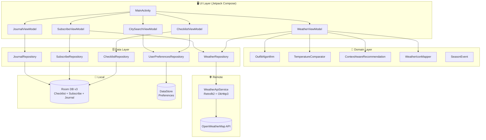

# 📋 SkyWear: 🇰🇷🇯🇵 KR-JP Smart Travel Outfit Coordinator
> **"Don't just check the weather. Know what to wear."**
>
> **SkyWear** [Sky (Weather) + Wear (Outfit)]: An Android-native solution designed to bridge the temperature gap between Korea and Japan, transforming raw weather data into actionable, culturally-aware travel outfit recommendations.

An Android travel companion that compares real-time and 5-day forecast weather between Korean and Japanese cities, delivers 8-stage outfit recommendations powered by Wind Chill and Heat Index algorithms, and adapts entirely to the traveler's direction — whether heading from Korea to Japan, or Japan to Korea. Lifecycle features including city subscription, seasonal recommendations, and a travel journal keep users engaged long after the trip ends.

---

## 🎯 Background & Motivation

### The Context: "Seamless Travel Experience"
Korea and Japan are the closest neighboring countries in Northeast Asia, yet their climates differ significantly due to latitude, terrain, and seasonal patterns. It is common for Seoul to be below freezing while Osaka remains comfortably above 10°C — a gap that can make or break a traveler's packing decision.

### The Problem
1. **Cross-reference Fatigue**: Travelers manually switch between Korean and Japanese weather apps, mentally calculating temperature differences without any outfit context.
2. **Numbers Without Meaning**: "8°C" alone doesn't tell a traveler whether they need a light coat or a heavy parka. Raw data lacks the outfit intelligence layer.
3. **One-Directional Design**: Most travel apps are built for a single market. There is no solution that seamlessly serves both Korean travelers heading to Japan *and* Japanese travelers heading to Korea.
4. **No Long-term Value**: Most weather apps are forgotten after a trip ends. There is no reason to return unless another trip is planned.

### The Solution
1. **Dual-City Dashboard**: Displays real-time and 5-day forecast weather for both departure and destination cities side-by-side, with daily min/max temperature and temperature gap visualization.
2. **8-Stage Outfit Engine**: Converts temperature into concrete outfit stages — from T-shirt + Shorts (28°C+) to Long Puffer + Scarf + Hand Warmers (below -1°C) — enhanced by Wind Chill and Heat Index corrections.
3. **Bidirectional Travel Mode**: A single toggle switches the entire app experience between KR→JP and JP→KR, including localized checklists, comparison messages, and outfit advice.
4. **Lifecycle Features**: City subscription, seasonal recommendations, and travel journal ensure users return even when not actively planning a trip.

- **Data Source**: OpenWeatherMap API (Current Weather + 5-Day Forecast)
- **Key Features**:
  1. **Dual-City Weather Comparison**: Side-by-side KR/JP weather cards with feels-like temperature and humidity
  2. **8-Stage Outfit Algorithm**: Temperature-to-outfit mapping with Wind Chill / Heat Index corrections
  3. **5-Day Forecast with Date Selector**: Daily min/max temperature across all time slots per day
  4. **Travel Direction Switch**: KR→JP ↔ JP→KR bidirectional toggle with full UX adaptation
  5. **Localized Checklist**: Direction-aware travel checklist (Japan trip / Korea trip) in 3 languages
  6. **City Subscription**: Follow up to 5 cities with real-time weather and alert toggle
  7. **Seasonal Recommendations**: D-day countdown for 8 JP + 8 KR major travel events, direction-aware
  8. **Travel Journal**: Record trip weather, outfit history, and personal memos
  9. **Full i18n**: Korean / English / Japanese localization across all screens
  10. **Responsive Layout**: Adaptive padding and typography for all screen sizes
  11. **Firebase Crashlytics**: Production crash monitoring with release-only collection

---

## ⚙️ Key Features

- **Outfit Intelligence**: Goes beyond temperature numbers to deliver stage-based outfit recommendations tailored to real feels-like conditions
- **Bidirectional UX**: Full experience swap — departure/destination cities, comparison messages, travel advice, checklists, and seasonal recommendations — with a single toggle
- **Long-term Engagement**: City subscription, travel journal, and seasonal events keep users returning between trips
- **Multilingual Support**: Complete localization in Korean, English, and Japanese including weather descriptions via dynamic API `lang` parameter
- **Responsive Design**: Adaptive layout with proportional spacing and typography across all Android devices

---

## 🛠️ Tech Stack

- **Language**: 
- **UI Framework**: 
- **Architecture**: 
- **DI**: 
- **Network**:  | 
- **Local DB**: 
- **Preferences**: 
- **Background**: 
- **Monitoring**: 
- **API**: 

---

## 🏗️ Architecture

---

## ✅ Milestone

- **Phase 1**: Project Foundation & Android Environment Setup
  - [x] Phase 1-1: Initialize GitHub Repository & Technical Documentation (README.md) & Project Board
  - [x] Phase 1-2: Setup Android Studio & Kotlin/Compose Development Environment
  - [x] Phase 1-3: Define Design System (Color Palette, Typography, & Brand Assets)
  - [x] Phase 1-4: Security Configuration (API Key Management & local.properties Setup)

- **Phase 2**: Network Layer & Weather Data Integration
  - [x] Phase 2-1: Architect Remote Data Source using Retrofit2 & OkHttp3
  - [x] Phase 2-2: Design Weather Data Transfer Objects (DTO) for OpenWeatherMap API
  - [x] Phase 2-3: Implement Dual-City Weather Fetching Logic (Source: KR / Destination: JP)
  - [x] Phase 2-4: Build Robust Error Handling & Interceptor for Network Stability

- **Phase 3**: Core Logic & Outfit Recommendation Engine
  - [x] Phase 3-1: Develop Temperature-based 8-Stage Smart Outfit Algorithm
  - [x] Phase 3-2: Implement Comparative Analysis Logic (KR vs JP Temperature Gap)
  - [x] Phase 3-3: Build Context-Aware Recommendation Logic (Wind Chill & Humidity)
  - [x] Phase 3-4: Reactive State Management Integration using ViewModel & StateFlow
  - [x] Phase 3-5: Design Asset Mapping Engine (Weather State to Visual Icons)

- **Phase 4**: Travel Intelligence & Data Persistence
  - [x] Phase 4-1: Implement Direction-Aware Travel Checklist using Room DB
  - [x] Phase 4-2: Develop City Search & User Preference Management Features
  - [x] Phase 4-3: Build Background Notification Service for Daily Travel Briefing
  - [x] Phase 4-4: Dark Mode Support

- **Phase 5**: Quality Assurance & Dependency Injection
  - [x] Phase 5-1: Execute UI Testing & Component Validation using Compose Test Rule
  - [x] Phase 5-2: Code Refactoring & Dependency Injection (Hilt) Optimization
  - [x] Phase 5-3: Final Build Generation (.APK)

- **Phase 6**: Main UI Implementation
  - [x] Phase 6-1: Navigation & Screen Integration
  - [x] Phase 6-2: Dual-City Weather Dashboard Screen
  - [x] Phase 6-3: City Search Screen
  - [x] Phase 6-4: Direction-Aware Travel Checklist Screen
  - [x] Phase 6-5: Bug Fixes & Code Quality Improvements

- **Phase 7**: Product Optimization
  - [x] Phase 7-1: Advanced Localization (Korean / English / Japanese)
  - [x] Phase 7-2: Travel Direction Switch (KR→JP ↔ JP→KR)
  - [x] Phase 7-3: Performance & Monitoring (Firebase Crashlytics, StrictMode)

- **Phase 8**: 5-Day Forecast Comparison
  - [x] Phase 8-1: Forecast API Integration & DTO (WeatherForecastResponse, DailyForecastPair)
  - [x] Phase 8-2: Forecast Dashboard UI with Date Selector & Daily Min/Max Temperature
  - [x] Phase 8-3: Project Retrospective & Feedback
  - [x] Phase 8-4: Technical Documentation

- **Phase 9**: Lifecycle Features & Long-term Engagement
  - [x] Phase 9-1: Bottom Navigation Bar Integration (Weather / Subscribe / Journal / Season)
  - [x] Phase 9-2: City Subscription & Weather Change Alerts (up to 5 cities)
  - [x] Phase 9-3: Seasonal Travel Recommendation Engine (8 JP + 8 KR events, direction-aware)
  - [x] Phase 9-4: Travel Journal & Weather History Log
  - [x] Phase 9-5: Portfolio Finalization & README Update
  - [x] Phase 9-6: Responsive Layout Optimization for all screen sizes

---

## 🔥 Troubleshooting & Lessons Learned

**1. KSP + Kotlin Version Compatibility**
- **Challenge**: Room Compiler KSP version mismatch with Kotlin 2.2.10 caused build failure at compile time.
- **Resolution**: Pinned `ksp = "2.2.10-2.0.2"` to exactly match the Kotlin version.

**2. Hilt — Missing `android:name` in AndroidManifest**
- **Challenge**: App crashed on launch with `Hilt Activity must be attached to an @HiltAndroidApp Application`.
- **Resolution**: Added `android:name=".SkyWearApplication"` to `<application>` tag in `AndroidManifest.xml`.

**3. ViewModel Instance Isolation Across Screens**
- **Challenge**: City selection in SearchScreen was not reflected in DashboardScreen — each screen created its own ViewModel instance via `hiltViewModel()`.
- **Resolution**: Elevated `hiltViewModel()` calls to NavGraph level and passed shared instances as parameters to each screen, ensuring a single source of truth.

**4. Travel Direction — Inverted Gap Degree Logic**
- **Challenge**: When direction was JP→KR and the destination (Korea) was colder, the app incorrectly advised "dress one layer lighter."
- **Root Cause**: `gapDegree` is always calculated as `jpTemp - krTemp`. The sign needed to be flipped for JP→KR direction to correctly represent the destination temperature delta.
- **Resolution**: Applied `directedGap = if (isKrToJp) gapDegree else -gapDegree` throughout comparison and advice logic.

**5. Compose i18n — `stringResource()` Context Constraint**
- **Challenge**: String generation for outfit recommendations and comparison messages was embedded in the Domain layer, making localization impossible since `stringResource()` requires a Composable context.
- **Resolution**: Removed all string generation from Domain layer. Created dedicated `@Composable` functions in the UI layer that call `stringResource()` directly.

**6. Room TypeConverter — Enum Persistence**
- **Challenge**: Room DB had no mechanism to store `ChecklistCategory` enum, risking a runtime crash on first checklist access.
- **Resolution**: Created `ChecklistConverters` class with `@TypeConverter` annotations for bidirectional `String ↔ ChecklistCategory` conversion.

**7. Dynamic City Name Localization**
- **Challenge**: OpenWeatherMap API always returns city names in English regardless of the `lang` parameter. Display names remained in English even when device language was set to Japanese.
- **Resolution**: Built `localizedCityName(nameEn: String)` lookup function in `CitySearchData.kt` that maps English API city names to native equivalents using a predefined city list.

**8. Forecast Date Filtering**
- **Challenge**: Past dates remained visible in forecast date selector tabs after midnight.
- **Resolution**: Added `.filter { it >= today }` using `java.time.LocalDate.now().toString()` with a renamed lambda parameter (`key`) to avoid shadowing the `dateKey()` extension function.

**9. Daily Min/Max Temperature Reliability**
- **Challenge**: A single 12:00 forecast slot showed high variability — a day might have a warm afternoon but a cold evening, making outfit advice misleading.
- **Resolution**: Extracted `minOf` and `maxOf` across all available 3-hour slots per day using `dailyRepresentativeWithTime()`, returning a `Triple` of (representative slot, time, min/max pair).

**10. Room DB Schema Evolution**
- **Challenge**: Adding `SubscribedCity` and `TravelJournal` entities required a safe migration path without data loss.
- **Resolution**: Implemented `MIGRATION_2_3` with explicit `CREATE TABLE IF NOT EXISTS` SQL statements, maintaining clean incremental migration from v1 → v2 → v3.

**11. Responsive Layout — White Space on Larger Screens**
- **Challenge**: Fixed padding (16dp) and `displayMedium` font caused excessive white space on larger phones.
- **Resolution**: Reduced vertical padding to 8dp, switched temperature display to `displaySmall`, and tightened card spacing from 16dp to 10dp across all screens.

---

## 📈 Results

- **Localization**: 100% string coverage in Korean, English, and Japanese across all screens including Subscribe, Journal, and Season screens
- **Bidirectional Support**: Full UX adaptation for both KR→JP and JP→KR travel modes including direction-aware seasonal recommendations
- **Forecast Accuracy**: Daily min/max temperature extracted from all available 3-hour slots — not just a single time slot
- **Long-term Engagement**: 4-tab lifecycle loop (Weather → Subscribe → Journal → Season)
- **Responsive Design**: Consistent layout across small (360dp) to large (420dp+) Android screens
- **Crash Monitoring**: Firebase Crashlytics integrated with release-only collection policy
- **Error Handling**: 6-type sealed class network error handling covering all failure scenarios
- **Architecture**: Strict 3-layer separation (Data / Domain / UI) with Room DB v3 and clean migration path

---

## 🧐 Self-Reflection

### Technical Growth
- **Algorithm to Product**: Translating meteorological formulas (Wind Chill, Heat Index) into a user-facing outfit recommendation system taught me the importance of bridging domain knowledge with engineering.
- **State Management Mastery**: Managing bidirectional travel state across multiple screens with `StateFlow`, `flatMapLatest`, and shared ViewModels deepened my understanding of reactive architecture in Jetpack Compose.
- **i18n Architecture**: Learning that internationalization must be a first-class architectural concern — not an afterthought — was one of the most valuable lessons of this project.
- **DB Migration Strategy**: Incremental Room migrations (`MIGRATION_1_2`, `MIGRATION_2_3`) demonstrated the importance of planning schema evolution from the start.

### Problem-Solving Mindset
- **Cultural Product Thinking**: Building for both Korean and Japanese travelers reinforced that great products require empathy for diverse user contexts, not just technical correctness.
- **Root Cause Over Quick Fix**: The gapDegree sign inversion bug could have been patched with a conditional, but understanding *why* the sign was wrong — and fixing the abstraction — produced a cleaner, more maintainable solution.
- **Layer Discipline**: Every time a string or logic leaked between layers, it created downstream i18n or testability problems. Respecting architectural boundaries is not academic — it has real engineering consequences.
- **User Lifecycle Thinking**: Realizing that "weather app for travelers" ends when the trip ends pushed the design toward a "KR-JP lifestyle companion" — a much stickier product concept.

---

## 🧐 Final Project Retrospective

### 💡 Engineering for Real Travelers
SkyWear was built around a genuine pain point: travelers don't need more weather data — they need weather *intelligence*. By combining real-time API data with a proprietary outfit algorithm, bidirectional travel support, and lifecycle features, this project demonstrates that mobile engineering can deliver tangible, human-centered value.

### 🚀 Technical Evolution: Architecture as a Foundation
Starting from a simple API call and evolving into a fully layered MVVM + Clean Architecture application with Hilt DI, Room v3 migrations, DataStore persistence, and Firebase monitoring taught me that architecture is not overhead — it is the foundation that makes every feature addition faster and safer.

### 🌏 Bridging Markets Through Technology
As a developer targeting the Japanese IT market, SkyWear represents my approach to engineering: identify a real cross-cultural friction point, and solve it with clean, maintainable, and user-empathetic code.

---

## ✨ Contact

- **GitHub Repository**: https://github.com/2daKaizen-gun/skywear
- **Email**: hkys1223@gmail.com

---

Built for ❤️ · SkyWear © 2026

