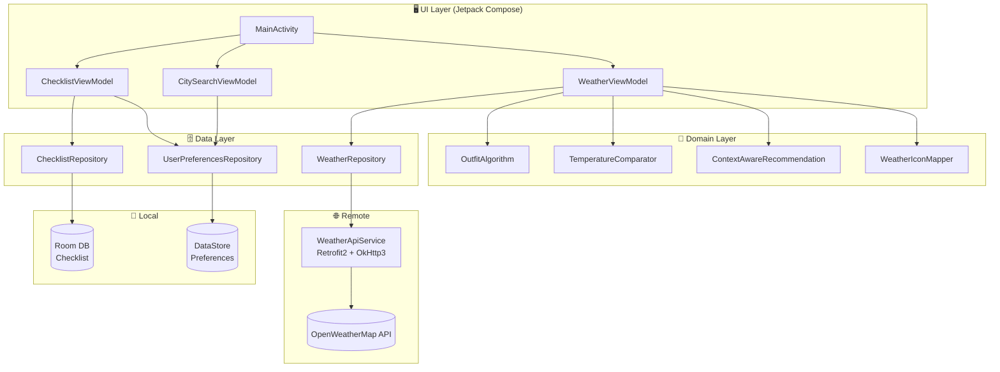

# 📋 SkyWear: 🇰🇷🇯🇵 KR-JP Smart Travel Outfit Coordinator
> **"Don't just check the weather. Know what to wear."**
>
> **SkyWear** [Sky (Weather) + Wear (Outfit)]: An Android-native solution designed to bridge the temperature gap between Korea and Japan, transforming raw weather data into actionable, culturally-aware travel outfit recommendations.

An AI-assisted Android travel companion that compares real-time weather between Korean and Japanese cities, delivers 8-stage outfit recommendations powered by Wind Chill and Heat Index algorithms, and adapts entirely to the traveler's direction — whether heading from Korea to Japan, or Japan to Korea.
 
---

## 🎯 Background & Motivation

### The Context: "Seamless Travel Experience"
Korea and Japan are the closest neighboring countries in Northeast Asia, yet their climates differ significantly due to latitude, terrain, and seasonal patterns. It is common for Seoul to be below freezing while Osaka remains comfortably above 10°C — a gap that can make or break a traveler's packing decision.

### The Problem
1. **Cross-reference Fatigue**: Travelers manually switch between Korean and Japanese weather apps, mentally calculating temperature differences without any outfit context.
2. **Numbers Without Meaning**: "8°C" alone doesn't tell a traveler whether they need a light coat or a heavy parka. Raw data lacks the outfit intelligence layer.
3. **One-Directional Design**: Most travel apps are built for a single market. There is no solution that seamlessly serves both Korean travelers heading to Japan *and* Japanese travelers heading to Korea.
### The Solution
1. **Dual-City Dashboard**: Displays real-time weather for both the departure and destination city side-by-side, with temperature gap visualization.
2. **8-Stage Outfit Engine**: Converts temperature into concrete outfit stages — from T-shirt + Shorts (28°C+) to Long Puffer + Scarf + Hand Warmers (below -1°C) — enhanced by Wind Chill and Heat Index corrections.
3. **Bidirectional Travel Mode**: A single toggle switches the entire app experience between KR→JP and JP→KR, including localized checklists, comparison messages, and outfit advice.
- **Data Source**: OpenWeatherMap API (Current Weather)
- **Key Features**:
  1. **Dual-City Weather Comparison**: Side-by-side KR/JP weather cards with feels-like temperature and humidity
  2. **8-Stage Outfit Algorithm**: Temperature-to-outfit mapping with Wind Chill / Heat Index corrections
  3. **Travel Direction Switch**: KR→JP ↔ JP→KR bidirectional toggle with full UX adaptation
  4. **Localized Checklist**: Direction-aware travel checklist (Japan trip / Korea trip) in 3 languages
  5. **Full i18n**: Korean / English / Japanese localization across all screens
  6. **Firebase Crashlytics**: Production crash monitoring with release-only collection
---

## ⚙️ Key Features

- **Outfit Intelligence**: Goes beyond temperature numbers to deliver stage-based outfit recommendations tailored to real feels-like conditions
- **Bidirectional UX**: Full experience swap — departure/destination cities, comparison messages, travel advice, and checklists — with a single toggle
- **Multilingual Support**: Complete localization in Korean, English, and Japanese including weather descriptions via dynamic API `lang` parameter
---

## 🛠️ Tech Stack

- **Language**: 
- **UI Framework**: 
- **Architecture**: 
- **DI**: 
- **Network**:  | 
- **Local DB**: 
- **Preferences**: 
- **Background**: 
- **Animation**: 
- **Monitoring**: 
- **API**: 
---

## 🏗️ Architecture


 
---

## ✅ Milestone
- **Phase 1**: Project Foundation & Android Environment Setup
  - [x] Phase 1-1: Initialize GitHub Repository & Technical Documentation (README.md) & Project Board
  - [x] Phase 1-2: Setup Android Studio & Kotlin/Compose Development Environment
  - [x] Phase 1-3: Define Design System (Color Palette, Typography, & Brand Assets)
  - [x] Phase 1-4: Security Configuration (API Key Management & local.properties Setup)

- **Phase 2**: Network Layer & Weather Data Integration
  - [x] Phase 2-1: Architect Remote Data Source using Retrofit2 & OkHttp3
  - [x] Phase 2-2: Design Weather Data Transfer Objects (DTO) for OpenWeatherMap API
  - [x] Phase 2-3: Implement Dual-City Weather Fetching Logic (Source: KR / Destination: JP)
  - [x] Phase 2-4: Build Robust Error Handling & Interceptor for Network Stability

- **Phase 3**: Core Logic & Outfit Recommendation Engine
  - [x] Phase 3-1: Develop Temperature-based 8-Stage Smart Outfit Algorithm
  - [x] Phase 3-2: Implement Comparative Analysis Logic (KR vs JP Temperature Gap)
  - [x] Phase 3-3: Build Context-Aware Recommendation Logic (Wind Chill & Humidity)
  - [x] Phase 3-4: Reactive State Management Integration using ViewModel & StateFlow
  - [x] Phase 3-5: Design Asset Mapping Engine (Weather State to Visual Icons)

- **Phase 4**: Travel Intelligence & Data Persistence
  - [x] Phase 4-1: Implement Japan-Specific Travel Checklist using Room DB or DataStore
  - [x] Phase 4-2: Develop City Search & User Preference Management Features
  - [x] Phase 4-3: Build Background Notification Service for Daily Travel Briefing
  - [x] Phase 4-4: UI Polish & Interactive Elements (Lottie Animations & Dark Mode)

- **Phase 5**: Quality Assurance & Portfolio Finalization
  - [x] Phase 5-1: Execute UI Testing & Component Validation using Compose Test Rule
  - [x] Phase 5-2: Code Refactoring & Dependency Injection (Hilt) Optimization
  - [x] Phase 5-3: Final Build Generation (.APK)

- **Phase 6**: Main UI Implementation
  - [x] Phase 6-1: Navigation & Screen Integration
  - [x] Phase 6-2: Dual-City Weather Dashboard Screen
  - [x] Phase 6-3: City Search Screen
  - [x] Phase 6-4: Japan Travel Checklist Screen
  - [x] Phase 6-5: Bug Fixes & Code Quality Improvements

- **Phase 7**: Product Optimization & Professional Portfolio
  - [x] Phase 7-1: Advanced Localization (Internationalization)
  - [x] Phase 7-2: Travel Direction Switch
  - [x] Phase 7-3: Performance & Monitoring
  - [] Phase 7-4: Project Retrospective & Feedback
  - [] Phase 7-5: Technical Documentation

---

## 🔥 Troubleshooting

### 1. KSP + Kotlin Version Compatibility
**Problem:** Room Compiler KSP version mismatch with Kotlin 2.2.10 caused build failure

**Solution:** Pinned `ksp = "2.2.10-2.0.2"` to match the exact Kotlin version

### 2. Hilt — Missing `android:name` in AndroidManifest
**Problem:** `Hilt Activity must be attached to an @HiltAndroidApp Application` crash on launch

**Solution:** Added `android:name=".SkyWearApplication"` to `AndroidManifest.xml`

### 3. DEX Version Compatibility (Test Function Names)
**Problem:** Backtick function names with spaces caused build errors on DEX versions below 040

**Solution:** Renamed all test functions using underscore convention

### 4. Missing Room TypeConverter
**Problem:** Potential crash when storing `ChecklistCategory` enum in Room DB

**Solution:** Created `ChecklistConverters` class and registered `@TypeConverters` annotation

### 5. ViewModel Instance Sharing Across Screens
**Problem:** City changes in SearchScreen were not reflected in DashboardScreen

**Root Cause:** Each screen created its own ViewModel instance via `hiltViewModel()`

**Solution:** Called `hiltViewModel()` at NavGraph level and passed instances as parameters to each screen

### 6. Travel Direction — gapDegree Sign Issue
**Problem:** When JP→KR and destination is colder, advice incorrectly said "dress lighter"

**Root Cause:** `gapDegree` is always calculated as JP - KR, but the sign needed to be flipped for JP→KR direction

**Solution:** Applied `directedGap = if (isKrToJp) gapDegree else -gapDegree`

### 7. Emulator Storage Space Insufficient
**Problem:** `Not enough space` error prevented APK installation

**Solution:** Device Manager → Show Advanced Settings → increased Internal Storage

### 8. Compose i18n — String Generation in Domain Layer
**Problem:** `stringResource()` can only be called from a Composable context

**Solution:** Removed all string generation from Domain layer; moved to UI layer as `@Composable` functions (`buildComparisonMessage()`, `buildTravelAdvice()`, etc.)
 
---

## 💡 Technical Growth

### Kotlin Language
- Practical use of Elvis operator (`?:`), Safe Call (`?.`), and sealed classes
- Extension Functions for clean DTO → UI transformation layer
- `flatMapLatest` for dynamic data switching based on StateFlow
- `@Composable` extension function patterns
### Android Architecture
- Strict layer separation with MVVM + Clean Architecture principles
- Unidirectional data flow with `StateFlow` + `collectAsState()`
- Complete dependency inversion with Hilt DI across ViewModel and Repository
- Room DB schema migration (`MIGRATION_1_2`)
### Network & Data
- Retrofit2 + OkHttp Interceptor pattern for centralized error handling
- Room DB Entity/DAO/Database three-layer structure
- DataStore for persistent settings across app restarts
- Firebase Crashlytics for production crash monitoring
### Internationalization (i18n)
- Android `strings.xml` for 3 locales (values/, values-en/, values-ja/)
- Clean separation between Domain and UI layers for string responsibility
- Dynamic API `lang` parameter detection for localized weather descriptions
- `localizedCityName()` mapping from English API response to native city names
---

## 🧐 Self-Reflection

### What Went Well
- **Layer Separation**: Strict Data / Domain / UI separation made each layer's responsibility crystal clear
- **Practical Algorithm**: The 8-stage outfit algorithm combined with Wind Chill / Heat Index corrections produces genuinely useful travel recommendations
- **Bidirectional Travel Support**: Supporting both KR→JP and JP→KR directions makes the app useful for both Korean and Japanese travelers
- **Complete i18n**: Outfit recommendations, comparison messages, and travel advice are all fully localized in 3 languages
### Areas for Improvement
- **Lottie Animations**: Actual Lottie JSON files for weather animations were not fully integrated with live API data
- **Test Coverage**: Network layer mock tests were not implemented
- **Pretendard Font**: Temporarily using `FontFamily.Default` due to build errors; custom font not yet applied
### What I Would Do Differently
- Apply test-driven development (TDD) from the beginning
- Define the i18n strategy before starting string generation in Domain layer
- Set up CI/CD pipeline from early stages
---

## 🚀 Future Roadmap

```
v1.1
├── GPS-based automatic KR city detection
├── 7-day weather forecast feature
└── Android App Widget support
 
v1.2
├── Pretendard custom font integration
├── Travel schedule-based weather alerts
└── Support for additional routes beyond KR-JP (China, Southeast Asia, etc.)
```
 
---

## ✨ Contact
* **GitHub**: https://github.com/2daKaizen-gun/skywear
* **Email**: hkys1223@gmail.com
---

<div align="center">
<sub>Built with ❤️ for KR-JP Travelers · SkyWear © 2025</sub>
</div>