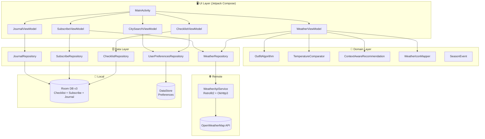

# 📋 SkyWear: 🇰🇷🇯🇵 한·일 온도 비교 스마트 트래블 코디 가이드
> **"날씨를 확인하는 것에서 그치지 말고, 무엇을 입을지 알아라."**
>
> **SkyWear** [Sky (날씨) + Wear (옷차림)]: 한국과 일본의 온도 차이를 연결하고, 날씨 데이터를 실질적인 여행 코디 추천으로 변환하는 Android 네이티브 솔루션.

한국과 일본의 실시간 및 5일 예보 날씨를 비교하고, Wind Chill·Heat Index 알고리즘 기반의 8단계 코디를 추천하며, 여행 방향(한국→일본 또는 일본→한국)에 완전히 적응하는 Android 여행 앱. 도시 구독, 계절별 추천, 여행 일지 등 라이프사이클 기능으로 여행이 끝난 후에도 지속적인 사용을 유도한다.

---

## 🎯 기획 배경 및 동기

### 컨텍스트: "끊김 없는 여행 경험"
한국과 일본은 동북아시아에서 가장 가까운 이웃 나라이지만, 위도·지형·계절 패턴의 차이로 기후가 크게 다릅니다. 서울이 영하권일 때 오사카가 10°C 이상인 경우는 흔하며, 이 온도 차이는 여행자의 짐 싸기 결정에 결정적인 영향을 미칩니다.

### 문제점
1. **교차 확인 피로**: 여행자는 한국·일본 날씨 앱을 번갈아 확인하며 코디 정보 없이 머릿속으로 온도 차이를 계산해야 합니다.
2. **숫자만 있는 데이터**: "8°C"라는 수치만으로는 가벼운 코트가 필요한지, 두꺼운 패딩이 필요한지 알 수 없습니다.
3. **단방향 설계의 한계**: 대부분의 여행 앱은 단일 시장을 위해 설계되어 있습니다. 한국→일본, 일본→한국 여행자를 모두 지원하는 솔루션은 없었습니다.
4. **장기 사용 가치 없음**: 대부분의 날씨 앱은 여행이 끝나면 사용이 중단됩니다. 다음 여행을 계획하지 않으면 다시 열 이유가 없습니다.

### 해결 방법
1. **Dual-City 대시보드**: 출발지·목적지의 실시간 및 5일 예보 날씨를 나란히 표시하고, 일별 최저/최고 온도와 온도 차이를 시각화합니다.
2. **8단계 코디 엔진**: 온도를 구체적인 코디 단계로 변환합니다. 반팔+반바지(28°C 이상)부터 롱패딩+목도리+핫팩(-1°C 이하)까지, Wind Chill·Heat Index 보정 적용.
3. **양방향 여행 모드**: 버튼 하나로 앱 전체 경험을 KR→JP ↔ JP→KR로 전환합니다. 현지화된 체크리스트, 비교 메시지, 코디 조언이 모두 방향에 맞게 바뀝니다.
4. **라이프사이클 기능**: 도시 구독, 계절별 추천, 여행 일지로 여행이 끝난 후에도 사용자가 앱으로 돌아오게 합니다.

- **데이터 소스**: OpenWeatherMap API (현재 날씨 + 5일 예보)
- **주요 기능**:
  1. **Dual-City 날씨 비교**: 체감온도·습도 포함 KR/JP 날씨 카드 나란히 표시
  2. **8단계 코디 알고리즘**: Wind Chill / Heat Index 보정을 적용한 온도→코디 매핑
  3. **5일 예보 + 날짜 선택**: 하루 전체 슬롯 기반 최저/최고 온도 표시
  4. **여행 방향 스위치**: KR→JP ↔ JP→KR 전환 시 UX 전체 적응
  5. **현지화 체크리스트**: 방향별 여행 체크리스트 3개 언어 지원
  6. **도시 구독**: 최대 5개 도시 실시간 날씨 + 알림 토글
  7. **계절별 추천**: JP 8개 + KR 8개 주요 여행 이벤트 D-day 카운트다운, 방향별 자동 전환
  8. **여행 일지**: 여행 날씨, 코디 기록, 개인 메모 저장
  9. **완전한 다국어 지원**: 모든 화면 한국어 / 영어 / 일본어 현지화
  10. **Firebase Crashlytics**: 릴리즈 빌드 전용 프로덕션 크래시 모니터링

---

## ⚙️ 핵심 기능

- **코디 인텔리전스**: 온도 수치를 넘어 실제 체감 조건에 맞춘 단계별 코디 추천
- **양방향 UX**: 출발지/목적지, 비교 메시지, 여행 조언, 체크리스트, 계절 추천까지 — 버튼 하나로 전체 경험 전환
- **장기 사용 유도**: 도시 구독, 여행 일지, 계절 이벤트로 여행 전·중·후 사이클 완성
- **다국어 지원**: API `lang` 파라미터 동적 감지를 통한 날씨 설명 포함 완전 한/영/일 현지화

---

## 🛠️ 기술 스택

- **언어**: 
- **UI 프레임워크**: 
- **아키텍처**: 
- **DI**: 
- **네트워크**:  | 
- **로컬 DB**: 
- **설정 저장**: 
- **백그라운드**: 
- **모니터링**: 
- **API**: 

---

## 🏗️ 아키텍처

---

## ✅ 마일스톤

- **Phase 1**: 프로젝트 기반 구축
  - [x] Phase 1-1: GitHub 저장소, README, 칸반 보드 초기화
  - [x] Phase 1-2: Android Studio & Kotlin/Compose 개발 환경 설정
  - [x] Phase 1-3: 디자인 시스템 정의 (색상, 타이포그래피, 브랜드 에셋)
  - [x] Phase 1-4: API Key 보안 관리 (local.properties + BuildConfig)

- **Phase 2**: 네트워크 레이어 & 날씨 데이터 연동
  - [x] Phase 2-1: Retrofit2 & OkHttp3 원격 데이터 소스 설계
  - [x] Phase 2-2: OpenWeatherMap DTO 설계
  - [x] Phase 2-3: Dual-City 날씨 동시 호출 구현
  - [x] Phase 2-4: 커스텀 NetworkInterceptor & 6종 에러 핸들링

- **Phase 3**: 핵심 로직 & 코디 추천 엔진
  - [x] Phase 3-1: 8단계 온도별 코디 알고리즘 개발
  - [x] Phase 3-2: KR vs JP 온도 비교 분석 로직
  - [x] Phase 3-3: Wind Chill & Heat Index 체감온도 보정
  - [x] Phase 3-4: StateFlow 기반 반응형 상태 관리
  - [x] Phase 3-5: 날씨 코드 → 이모지/색상 매핑 엔진

- **Phase 4**: 여행 인텔리전스 & 데이터 영속성
  - [x] Phase 4-1: 방향별 여행 체크리스트 Room DB 구현
  - [x] Phase 4-2: 도시 검색 & 사용자 설정 영구 저장
  - [x] Phase 4-3: WorkManager 백그라운드 알림 서비스
  - [x] Phase 4-4: 다크 모드 지원

- **Phase 5**: QA & 의존성 주입
  - [x] Phase 5-1: Compose Test Rule 단위/UI 테스트
  - [x] Phase 5-2: Hilt DI 전면 도입 & 코드 리팩토링
  - [x] Phase 5-3: APK 빌드 생성

- **Phase 6**: 메인 UI 구현
  - [x] Phase 6-1: 네비게이션 & 화면 통합
  - [x] Phase 6-2: Dual-City 날씨 대시보드 화면
  - [x] Phase 6-3: 도시 검색 화면
  - [x] Phase 6-4: 방향별 여행 체크리스트 화면
  - [x] Phase 6-5: 버그 수정 & 코드 품질 개선

- **Phase 7**: 제품 최적화
  - [x] Phase 7-1: 완전한 다국어 지원 (한국어 / 영어 / 일본어)
  - [x] Phase 7-2: 여행 방향 스위치 (KR→JP ↔ JP→KR)
  - [x] Phase 7-3: 성능 & 모니터링 (Firebase Crashlytics, StrictMode)

- **Phase 8**: 5일 예보 비교
  - [x] Phase 8-1: 예보 API 연동 & DTO 설계
  - [x] Phase 8-2: 날짜 선택 탭 + 일별 최저/최고 온도 UI
  - [x] Phase 8-3: 프로젝트 회고 & 피드백
  - [x] Phase 8-4: 기술 문서화

- **Phase 9**: 라이프사이클 기능 & 장기 사용 유도
  - [x] Phase 9-1: Bottom Navigation Bar 통합 (날씨 / 구독 / 일지 / 추천)
  - [x] Phase 9-2: 도시 구독 & 날씨 변화 알림 (최대 5개 도시)
  - [x] Phase 9-3: 계절별 여행 추천 엔진 (JP 8개 + KR 8개, 방향별 전환)
  - [x] Phase 9-4: 여행 일지 & 날씨 기록
  - [x] Phase 9-5: 포트폴리오 마무리 & README 업데이트

---

## 🔥 트러블슈팅 & 교훈

**1. KSP + Kotlin 버전 호환성**
- **문제**: Room Compiler KSP 버전이 Kotlin 2.2.10과 맞지 않아 컴파일 타임 빌드 실패.
- **해결**: `ksp = "2.2.10-2.0.2"`로 Kotlin 버전에 정확히 대응하는 버전 고정.

**2. Hilt — AndroidManifest `android:name` 누락**
- **문제**: 앱 실행 시 `Hilt Activity must be attached to an @HiltAndroidApp Application` 크래시.
- **해결**: `AndroidManifest.xml`의 `<application>` 태그에 `android:name=".SkyWearApplication"` 추가.

**3. 화면 간 ViewModel 인스턴스 격리**
- **문제**: SearchScreen에서 도시를 변경해도 DashboardScreen에 반영되지 않음.
- **근본 원인**: 각 화면이 `hiltViewModel()`로 별도 인스턴스를 생성했기 때문.
- **해결**: `hiltViewModel()` 호출을 NavGraph 레벨로 끌어올리고 공유 인스턴스를 파라미터로 전달.

**4. 여행 방향 — gapDegree 부호 반전 로직**
- **문제**: JP→KR 방향에서 목적지(한국)가 더 추운데 "한 겹 가볍게 입으세요"라고 잘못 출력.
- **근본 원인**: `gapDegree`는 항상 `jpTemp - krTemp`로 계산되므로 JP→KR 방향에서 부호 반전 필요.
- **해결**: `directedGap = if (isKrToJp) gapDegree else -gapDegree` 적용.

**5. Compose i18n — `stringResource()` 컨텍스트 제약**
- **문제**: 코디 추천·비교 메시지 문자열 생성이 Domain 레이어에 내장되어 현지화 불가.
- **해결**: Domain 레이어에서 모든 문자열 생성 제거. UI 레이어에 `@Composable` 함수로 이동.

**6. Room TypeConverter — Enum 영속성**
- **문제**: Room DB가 `ChecklistCategory` enum을 저장하는 방법을 몰라 런타임 크래시 가능성.
- **해결**: `@TypeConverter` 어노테이션으로 `String ↔ ChecklistCategory` 양방향 변환 클래스 생성.

**7. 동적 도시명 현지화**
- **문제**: OpenWeatherMap API는 `lang` 파라미터와 관계없이 도시명을 항상 영어로 반환.
- **해결**: `CitySearchData.kt`에 `localizedCityName(nameEn)` 조회 함수 구현. 영어 API 응답 → 현지어 매핑.

**8. 예보 날짜 필터링**
- **문제**: 자정이 지나도 과거 날짜가 예보 날짜 선택 탭에 남아있음.
- **해결**: `java.time.LocalDate.now().toString()`으로 오늘 이전 날짜 필터링. 람다 파라미터명 충돌(`dateKey` → `key`)도 함께 수정.

**9. 일별 최저/최고 온도 신뢰도**
- **문제**: 12시 단일 슬롯은 하루 온도 변동성이 커서 코디 조언에 오해를 줄 수 있음.
- **해결**: `dailyRepresentativeWithTime()`으로 하루 전체 슬롯에서 `minOf`/`maxOf` 추출. `Triple`로 대표슬롯·시간·최저/최고 쌍 반환.

**10. Room DB 스키마 진화**
- **문제**: `SubscribedCity`, `TravelJournal` 엔티티 추가 시 기존 데이터 손실 없는 마이그레이션 필요.
- **해결**: `MIGRATION_2_3`에 명시적 `CREATE TABLE IF NOT EXISTS` SQL 구문으로 v1→v2→v3 증분 마이그레이션 구현.

---

## 📈 성과

- **현지화**: 구독·일지·추천 화면 포함 모든 화면 한국어·영어·일본어 100% 문자열 커버리지
- **양방향 지원**: KR→JP 및 JP→KR 방향별 계절 추천 포함 완전한 UX 적응
- **예보 정확도**: 단일 시간 슬롯이 아닌 하루 전체 슬롯 기반 최저/최고 온도 추출
- **장기 사용 유도**: 날씨→구독→일지→추천 4탭 라이프사이클 루프
- **크래시 모니터링**: Firebase Crashlytics 릴리즈 전용 수집 정책으로 통합
- **에러 핸들링**: 6종 Sealed Class 네트워크 에러 핸들링으로 모든 실패 시나리오 대응
- **아키텍처**: Room DB v3 + 깔끔한 마이그레이션 경로를 갖춘 엄격한 3계층 분리

---

## 🧐 Self-Reflection

### 기술적 성장
- **알고리즘에서 제품으로**: 기상학적 공식(Wind Chill, Heat Index)을 사용자 대면 코디 추천 시스템으로 변환하는 과정에서, 도메인 지식과 엔지니어링을 연결하는 것의 중요성을 배웠습니다.
- **상태 관리 심화**: `StateFlow`, `flatMapLatest`, 공유 ViewModel을 활용해 여러 화면에 걸친 양방향 여행 상태를 관리하면서 Jetpack Compose의 반응형 아키텍처에 대한 이해가 깊어졌습니다.
- **i18n 아키텍처**: 국제화는 사후 처리가 아닌 1급 아키텍처 관심사여야 한다는 것을 이 프로젝트에서 가장 중요한 교훈 중 하나로 얻었습니다.
- **DB 마이그레이션 전략**: 증분 Room 마이그레이션(`MIGRATION_1_2`, `MIGRATION_2_3`)은 스키마 진화를 처음부터 계획하는 것의 중요성을 보여주었습니다.

### 문제 해결 사고방식
- **문화적 제품 사고**: 한국과 일본 여행자 모두를 위한 설계는, 훌륭한 제품이 기술적 정확성만이 아니라 다양한 사용자 맥락에 대한 공감을 요구한다는 것을 재확인시켜 주었습니다.
- **빠른 수정이 아닌 근본 원인 해결**: gapDegree 부호 반전 버그는 조건문 하나로 패치할 수도 있었지만, 왜 부호가 틀렸는지를 이해하고 추상화를 수정한 것이 더 깔끔하고 유지보수하기 쉬운 해결책을 만들었습니다.
- **레이어 규율**: 문자열이나 로직이 레이어 간에 누수될 때마다 하위 i18n 또는 테스트 가능성 문제가 발생했습니다. 아키텍처 경계를 존중하는 것은 학문적인 것이 아니라 실질적인 엔지니어링 결과를 가져옵니다.
- **사용자 라이프사이클 사고**: "여행자를 위한 날씨 앱"은 여행이 끝나면 끝난다는 것을 깨닫고, "한·일 라이프스타일 컴패니언"으로 방향을 전환한 것이 훨씬 더 지속 가능한 제품 개념을 만들었습니다.

---

## 🧐 최종 회고

### 💡 실제 여행자를 위한 엔지니어링
SkyWear는 진짜 불편함에서 출발했습니다. 여행자에게 필요한 것은 더 많은 날씨 데이터가 아니라 날씨 *인텔리전스*입니다. 실시간 API 데이터와 독자적인 코디 알고리즘, 양방향 여행 지원, 라이프사이클 기능을 결합함으로써, 모바일 엔지니어링이 진정한 인간 중심의 가치를 제공할 수 있음을 보여주는 프로젝트입니다.

### 🚀 기술적 진화: 아키텍처를 기반으로
단순한 API 호출에서 시작해 Hilt DI, Room v3 마이그레이션, DataStore 영속성, Firebase 모니터링을 갖춘 완전한 계층형 MVVM + Clean Architecture 앱으로 발전시키는 과정은, 아키텍처가 부담이 아니라 모든 기능 추가를 더 빠르고 안전하게 만드는 기반임을 가르쳐 주었습니다.

### 🌏 기술로 시장을 연결하다
일본 IT 시장을 목표로 하는 개발자로서, SkyWear는 저의 엔지니어링 접근 방식을 대표합니다. 실제 교차 문화적 마찰 지점을 찾아내고, 깔끔하고 유지보수 가능하며 사용자 공감적인 코드로 해결하는 것입니다.

---

## ✨ Contact

- **GitHub Repository**: https://github.com/2daKaizen-gun/skywear
- **Email**: hkys1223@gmail.com

---

Built with ❤️ for KR-JP Travelers · SkyWear © 2026

